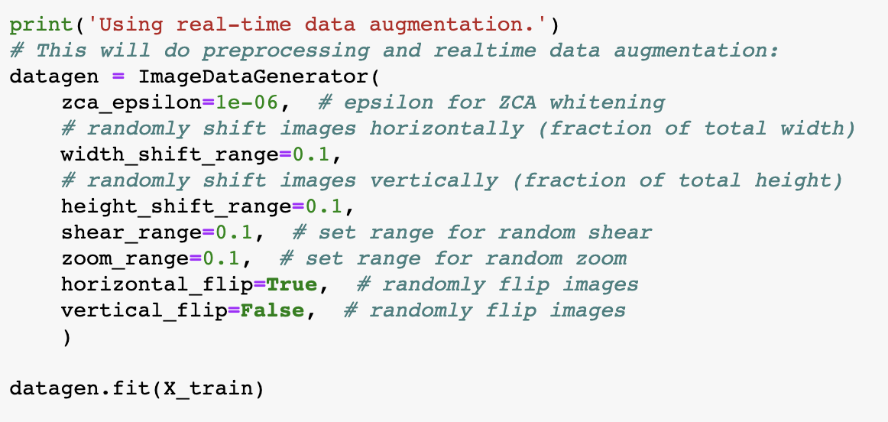
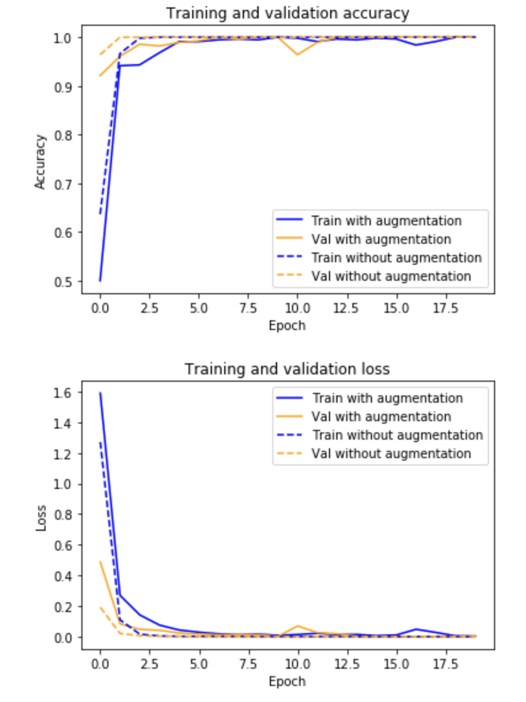
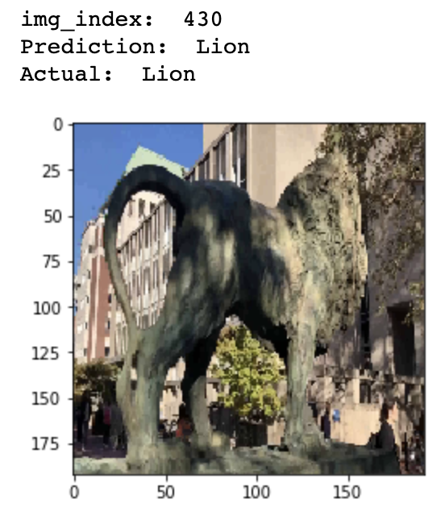
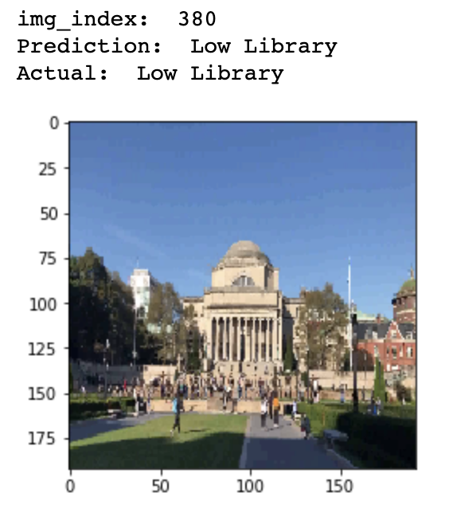
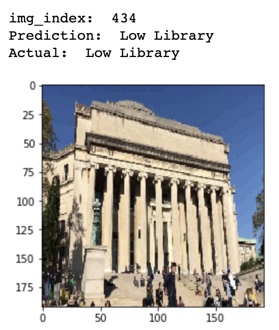

# Recognize Landmarks on Columbia Campus in the Browser

In this project, I built a deep learning model to recognize landmarks (famous places, like the Alma Mater sculpture, or Butler library) on Columbia's campus, and get it working in the browser.

Website: https://queensize706.github.io/Recognize-landmarks-on-Columbia-campus-in-the-browser/

## Built With

* [Keras](https://keras.io/) - The deep learning framework used
* [TensorFlow.js](https://www.tensorflow.org/js) - Used to convert Python TensorFlow models to run in the browser

## Data Collection
Collect a dataset of at least three landmarks, including Low Library, Statue Lion, and Sundial. First make a video of these three landmarks, and then use it to generate a list of JPG images using OpenCV.

## Construct Model
- Using Realtime Data Augmentation

  

    
  

- Plots of Accuracy / Loss

  

- Show Predictions on Several Images

  
  
  

## Run Model in the Browser
Save and download the model, and use TensorFlowjs to convert `model.h5` file to TensorFlow.js format. Then we can start a HTTP Server on our local machine (if we simply open index.html in a browser, we may run into security protections that prevent it from loading scripts).

To start a server, we can use one built-in to Python.

`$ python3 -m http.server [port]`

Finally, open a browser using the given URL. The designed webpage should appear.

## Author

* **Lu Liu** - M.S. in Computer Engineering, Columbia University

## License

This project is licensed under the MIT License
